<!--
THESIS: The profile renders as the thing Ayush actually builds — a multi-agent system. Bespoke SVG art and a real architecture diagram replace the assembled-from-generators dashboard every ML profile ships.
OWN-WORLD: obsidian #07070F ground, electric blue #60A5FA, gold/amber #F59E0B signal accent; hand-authored animated SVG (node graph, flowing edges, breathing nodes); mono for system text, heavy tracked sans for the wordmark.
STORY: visitor sees a living agent graph, reads one positioning line, then meets a real topology diagram that proves the claim before any project list — depth first, links second.
FIRST VIEWPORT: full-bleed animated agent-graph banner, name at center, one-line thesis beneath, single quiet link row.
FORM: systems-diagram grammar — the visual language of the domain itself, not the dev-template dashboard.
FINISH: static README; SVGs verified by headless-Chromium render; documented in DESIGN.md.
-->

 

 

I build **autonomous agent systems** — the kind that plan, retrieve, critique their own output, and recover from being wrong. Most of my work starts as a paper and ends as something with a URL you can open right now. Below is how I think about the problem, then the systems themselves.

 

## The problem I keep solving

A single LLM call is a guess. It cannot tell you how confident it is, cannot go find what it's missing, and cannot notice it answered the wrong question. Every system here is an answer to that: **give the model a loop, an external memory, and something that grades it.**

| Layer | How I build it |
|:--|:--|
| **Orchestration** | Cyclic graphs over linear chains — agents that route, retry, and terminate on a condition rather than running a fixed sequence |
| **Retrieval** | Vector search as working memory, not a lookup table — episodic context scoped per run, semantic context that survives across them |
| **Verification** | Self-critique as an explicit node, conformal intervals, SHAP and cross-attention attributions — a model that shows its reasoning is auditable |

 

## How the systems are wired

The critic is the part that matters. A linear `plan → search → write` chain produces confident nonsense when retrieval comes back thin. Making critique a **routing node** instead of a post-processing step means the graph can send itself back for more evidence before it ever writes — the difference between a demo and something you'd let near real work.

 

## Selected work

### 🔬 [AI Research Assistant Pipeline](https://github.com/AyushDas4890/AI-Research-Assistant-Pipeline)

Five-agent LangGraph system that plans, searches, reads, self-critiques, and writes structured research reports. Dual-layer memory via ChromaDB; results stream to the client over SSE rather than blocking on the full generation, reducing perceived latency by 87%.

**`LangGraph`** **`OpenAI`** **`ChromaDB`** **`FastAPI`** **`Tavily`**

[**→ Open the live demo**](https://ayushdas4890-ai-research-assistant-pipeline-app-1sjuvf.streamlit.app/)

---

### ⚖️ [Legal-Financial Conflict Resolver](https://github.com/AyushDas4890/Legal-Conflict-Resolver)

Five-phase NLP pipeline that detects contradictions between legal documents. DeBERTa-v3-large for entailment, FAISS for clause alignment, and cross-attention heatmaps so a reviewer can see *which spans* drove the call — explainability being non-optional in a legal context.

**`DeBERTa-v3`** **`HuggingFace`** **`FAISS`** **`spaCy`** **`FastAPI`** **`React`**

[**→ Open the live demo**](https://website-orpin-chi-25.vercel.app)

---

### 🧬 [Cancer TF Discovery Atlas](https://github.com/AyushDas4890/cancer-tf-dashboard)

Pan-cancer transcription-factor analysis over TCGA RNA-Seq data, surfaced as an interactive 3D dashboard. Identifies 19 lineage-specific transcription factors at **98.76%** classifier accuracy — and independently rediscovers known master regulators (HNF1B, GATA3, NKX2-1), which is the result that says the pipeline is finding biology rather than fitting noise.

**`Next.js`** **`Three.js`** **`scikit-learn`** **`Python`** **`Tailwind`**

[**→ Open the live demo**](https://cancer-tf-dashboard.vercel.app)

---

### 🌍 [Carbon Footprint Generator — C4Future](https://github.com/AyushDas4890/Carbon_Footprint_Generator)

Production carbon-accounting platform: XGBoost predictions wrapped in **conformal intervals** (so the output carries a calibrated uncertainty range, not a bare point estimate), a RAG sustainability advisor over real LCA data, an agentic bill-of-materials decomposer, and SHAP attributions on every prediction.

**`Django`** **`XGBoost`** **`LangChain`** **`ChromaDB`** **`OpenAI`** **`Docker`**

[**→ Open the live demo**](https://ad074890-c4future.hf.space)

 

## Stack

**Orchestration** — LangGraph · LangChain · agent routing, tool use, streaming 
**Retrieval** — ChromaDB · FAISS · embedding pipelines, hybrid ranking 
**Modeling** — PyTorch · Transformers · DeBERTa fine-tuning · XGBoost · SHAP 
**Serving** — FastAPI · Django · Streamlit · Docker · Vercel · HF Spaces

---

### Currently building agentic systems — and open to collaborating on hard ones.

[**ayushdas4890@gmail.com**](mailto:ayushdas4890@gmail.com) &nbsp;·&nbsp; [**LinkedIn**](https://linkedin.com/in/ayushdas4890) &nbsp;·&nbsp; [**Portfolio**](https://portfolio-website-zeta-topaz-84.vercel.app/)

